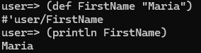
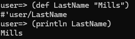
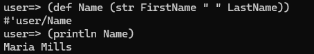
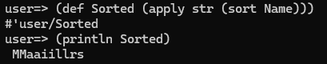
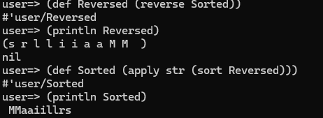

# Clojure - Project 7

## Name: Maria Mills

### Step 1:

1.  Create a string assigned to the variable FirstName
    

2.  Create a string assigned to the variable LastName
    

3.  Create a string assigned to the variable Name that concatenates FirstName and LastName, removing any blank characters
    

4.  Sort and display Name’s characters in alphabetical order
    

5.  Reverse and display Name
    

6.  Sort and display Name in reverse alphabetical order
    

#### Resources

- Class slides
- [learnxinyminutes](https://learnxinyminutes.com/docs/clojure/)
- [variables](https://www.tutorialspoint.com/clojure/clojure_variables.htm)
- [str](https://clojuredocs.org/clojure.core/str)
- [sort](https://clojuredocs.org/clojure.core/sort)
- [apply](https://clojuredocs.org/clojure.core/apply)
- [reverse](https://clojuredocs.org/clojure.string/reverse)

##### What I didn't like:

- I was not a fan of the parentheses, it's unusual to me.

##### What I liked:

- How simple everything was, the documentation is great and there is pretty much a function for everything. I had no real issues trying to find what I needed, which is always a plus.
