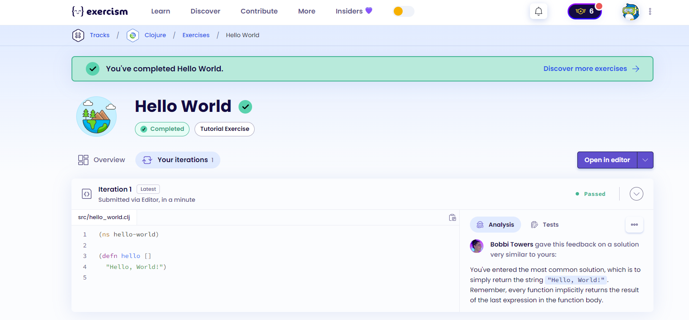
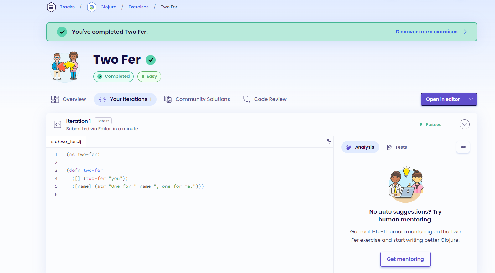
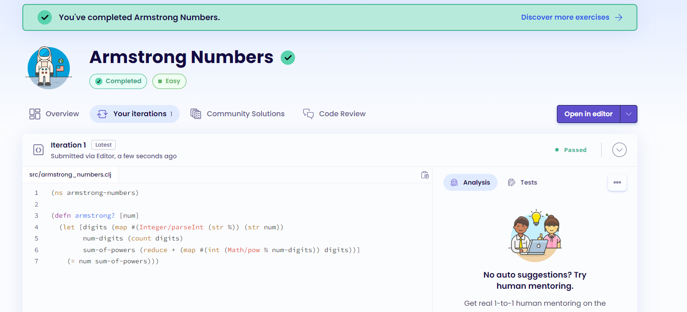
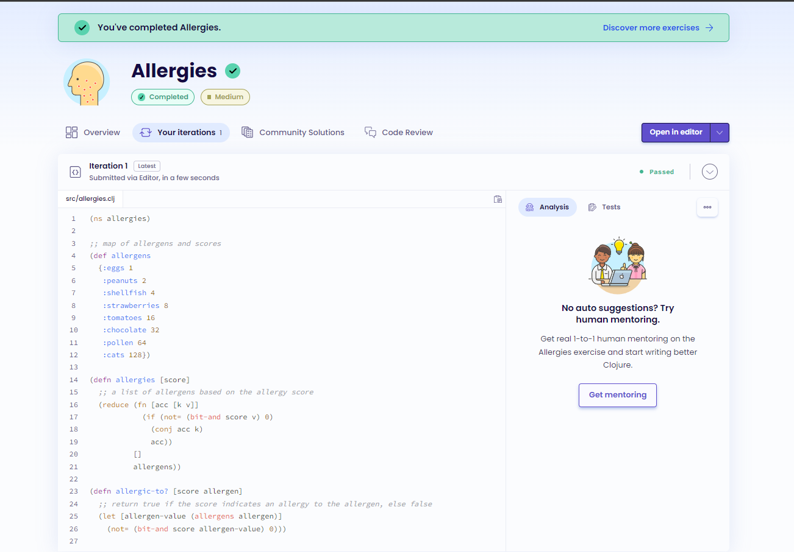
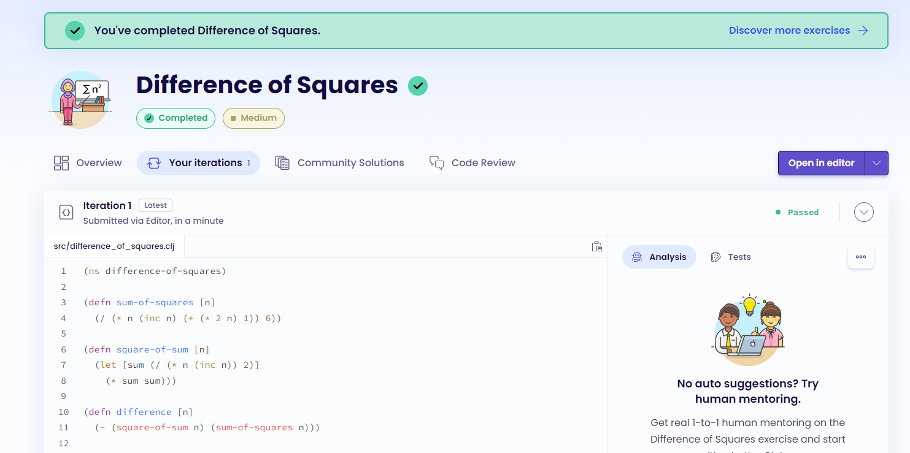

# Clojure - Project 7

## Name: Maria Mills

### Step 3:

1. Hello World
   

2. Two-fer
   

3. Armstrong Numbers
   

4. Allergies
   

5. Difference of Squares
   

#### Resources

- Class slides
- [learnxinyminutes](https://learnxinyminutes.com/docs/clojure/)
- [variables](https://www.tutorialspoint.com/clojure/clojure_variables.htm)
- [str](https://clojuredocs.org/clojure.core/str)
- [how to cast char to int](https://stackoverflow.com/questions/19749624/how-to-cast-a-character-to-int-in-clojure)
- [int](https://clojuredocs.org/clojure.core/int)
- [math](https://clojuredocs.org/clojure.math/pow)
- [reduce](https://clojuredocs.org/clojure.core/reduce)
