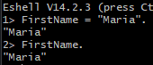
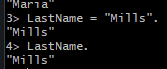
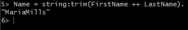
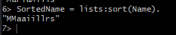
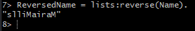
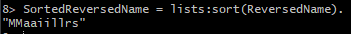

# Erlang - Project 6

## Name: Maria Mills

### Step 1:

- Create a string assigned to the variable FirstName:
  

- Create a string assigned to the variable LastName:
  

- Create a string assigned to the variable Name that concatenates FirstName and LastName, removing any blank characters:
  

- Sort and display Name’s characters in alphabetical order:
  

- Reverse and display Name:
  

- Sort and display Name in reverse alphabetical order:
  

#### Resources

- The book
- The slides
- [learnxinyminutes](https://learnxinyminutes.com/docs/erlang/)
- [Joining literal text to a variable](https://stackoverflow.com/questions/36100626/joining-literal-text-to-a-variable-string-concatenation-in-erlang)
- [How to strip all blank characters in a string](https://stackoverflow.com/questions/12794358/how-to-strip-all-blank-characters-in-a-string-in-erlang)
- [How to sort a list](https://stackoverflow.com/questions/47382273/how-to-sort-a-list-in-ascending-or-descending-order)
- [sort-1](https://www.erlang.org/doc/man/lists#sort-1)
- [reverse-1](https://www.erlang.org/doc/man/lists#reverse-1)

##### Issues:

- Step 1 really gave me no issues, it was pretty straightforward. I was able to complete it in about 10 minutes. I was able to find resources on anything I was unsure about.
