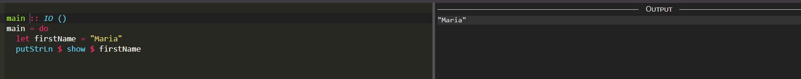
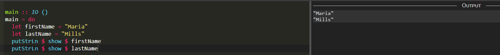
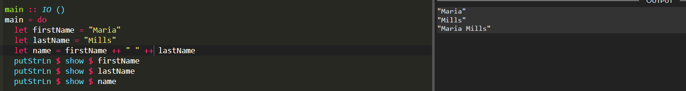
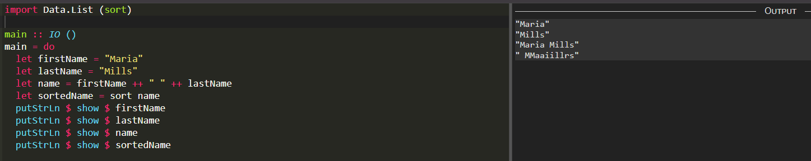
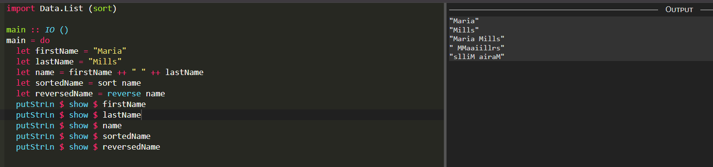
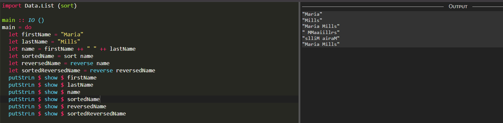

# Haskell - Project 7

## Name: Maria Mills

### Step 2:

1. Create a string assigned to the variable FirstName
   

2. Create a string assigned to the variable LastName
   

3. Create a string assigned to the variable Name that concatenates FirstName and LastName, removing any blank characters
   

4. Sort and display Name’s characters in alphabetical order
   

5. Reverse and display Name
   

6. Sort and display Name in reverse alphabetical order
   

#### Resources

- [learnxinyminutes](https://learnxinyminutes.com/docs/haskell/)
- [play.haskell](https://play.haskell.org/)
- [printing](https://stackoverflow.com/questions/35779737/haskell-printing-strings)
- [how to concat](https://stackoverflow.com/questions/10755852/how-to-concat-two-io-strings-in-haskell)
- [sort](https://zvon.org/other/haskell/Outputlist/sort_f.html)
- [reverse](https://zvon.org/other/haskell/Outputprelude/reverse_f.html)

##### What I didn't like:

- I don't know how I exactly feel about it's functional programming style, I'm not sure if I like it or not, it's just different.

##### What I liked:

- I also liked how easy it was to find resources, anything I wanted to know how to do was a simple Google search away.
- I like the lack of parentheses, especially after working with Clojure.
