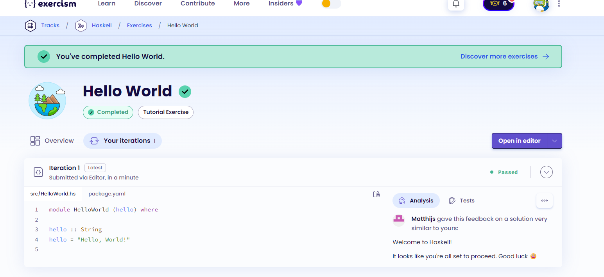
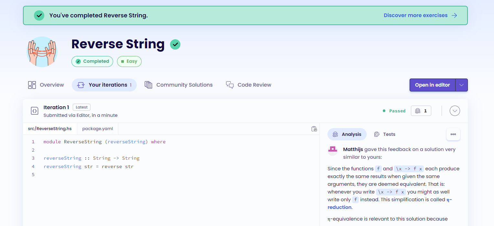
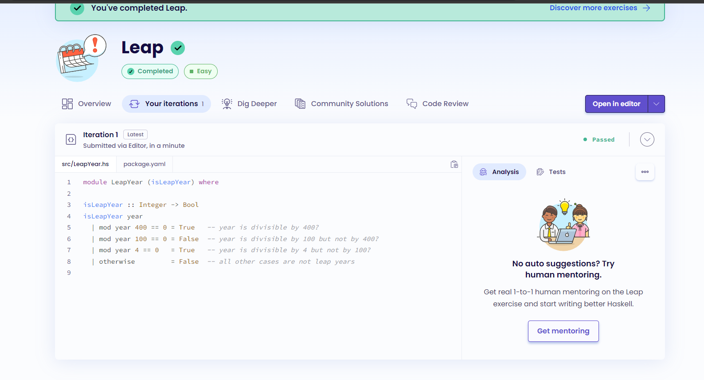
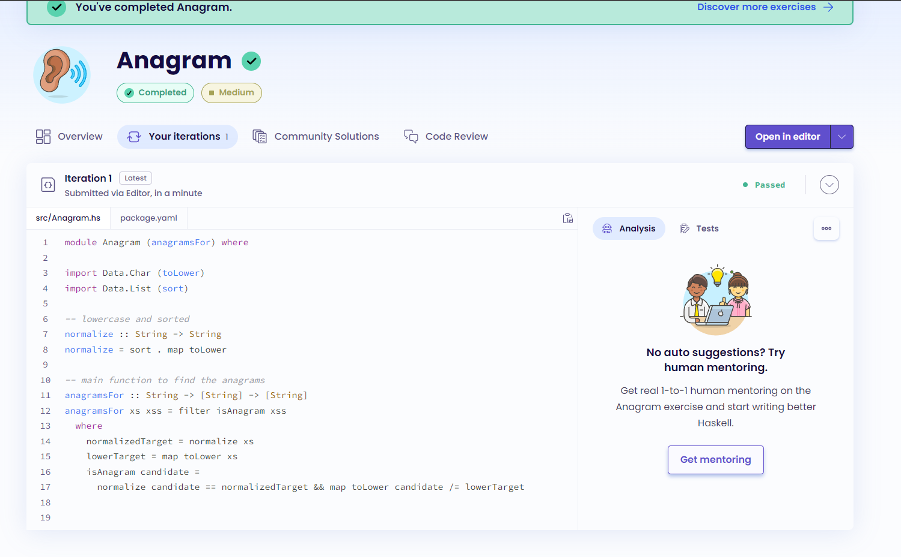
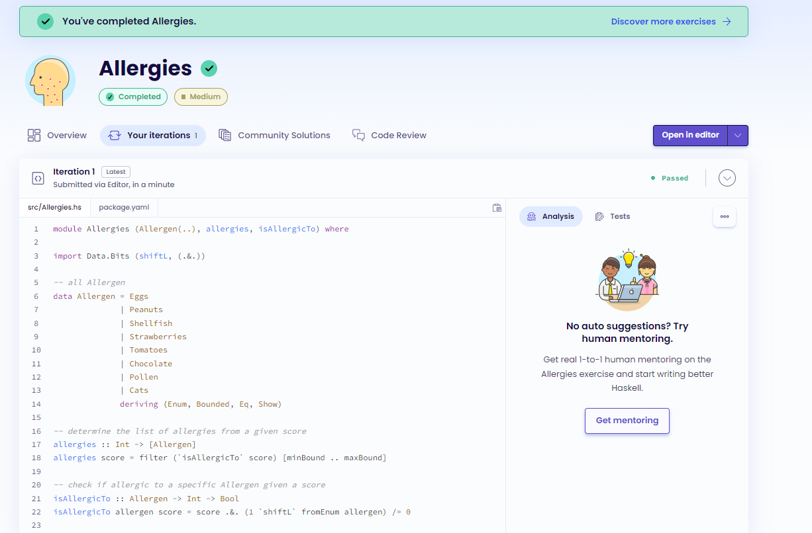

# Haskell - Project 7

## Name: Maria Mills

### Step 4:

1. Hello World
   

2. Reverse String
   

3. Leap
   

4. Anagram
   

5. Allergies
   

#### Resources

- [learnxinyminutes](https://learnxinyminutes.com/docs/haskell/)
- [play.haskell](https://play.haskell.org/)
- [printing](https://stackoverflow.com/questions/35779737/haskell-printing-strings)
- [how to concat](https://stackoverflow.com/questions/10755852/how-to-concat-two-io-strings-in-haskell)
- [sort](https://zvon.org/other/haskell/Outputlist/sort_f.html)
- [reverse](https://zvon.org/other/haskell/Outputprelude/reverse_f.html)
- [toLower](https://stackoverflow.com/questions/46568661/how-do-i-correctly-use-tolower-in-haskell)
- [Data.Bits](https://hackage.haskell.org/package/base-4.19.1.0/docs/Data-Bits.html)
