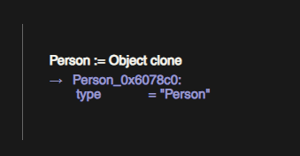
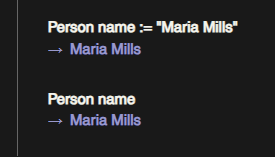
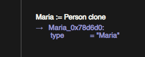
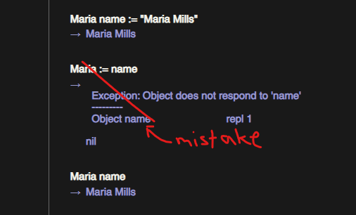
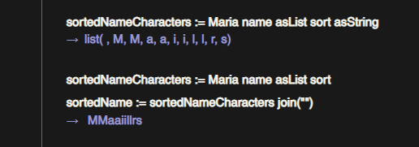
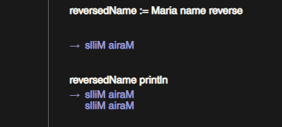
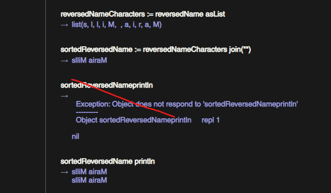
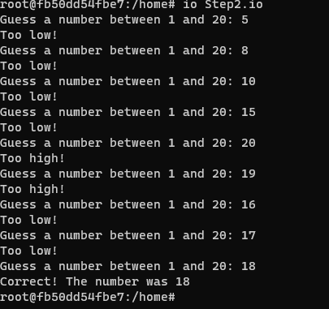
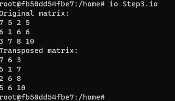

# Io Exploration - Project 3

## Name: Maria Mills

## Issues:

I wrote these issues when doing Step 1, for a more detailed and overall list of issues, see the bottom of the README.

- Io is not as popular as Ruby so it was harder to find resources.
- Also, had trouble installing Io on my Windows machine, couldn't get it to compile. ~~I had to use my Mac to brew install it.~~ (I thought this was the route I was going to end up taking, but I ended up using a Docker container on a Ubuntu machine because I couldn't get it to install on my Mac either).
- [Io Reference](https://iolanguage.org/reference/) was helpful but for reason, the website was super laggy, which made it hard to use.

## Part 2a

### Step 1:

---

---

---

---

---

---

#### Resources

- The book
- [Io Guide](https://iolanguage.org/guide/guide.html)
- [Io Reference](https://iolanguage.org/reference/) - This was the **biggest** help, it showed most functions, such as `join`, `sort`, `reverse` and many more useful good-to-know functions.'
- [Io Samples](https://iolanguage.org/samples/index.html) - Good examples.
- Class slides

---

### Step 2:

#### Resources

- [Io Wiki](https://en.wikibooks.org/wiki/Io_Programming#:~:text=Use%20the%20double%20dot%20operator,string%20interpolation%2C%20as%20shown%20below.&text=Now%2C%20calling%20olle%20fullname%20will,parentheses)%20for%20the%20method%20..) - This was helpful for string concatenation & interpolation. And just overall a good reference for Io.
- [Io Reference](https://iolanguage.org/reference/)
- [Io Guide](https://iolanguage.org/guide/guide.html)
- [Io Samples](https://iolanguage.org/samples/index.html)
- Class slides (the gift, comment(s), user input, more helpful syntax info)

### Step 3:

#### Resources

- [Io Wiki](https://en.wikibooks.org/wiki/Io_Programming#:~:text=Use%20the%20double%20dot%20operator,string%20interpolation%2C%20as%20shown%20below.&text=Now%2C%20calling%20olle%20fullname%20will,parentheses)%20for%20the%20method%20..)
- [Io Reference](https://iolanguage.org/reference/)
- [Io Guide](https://iolanguage.org/guide/guide.html)
- [Io Samples](https://iolanguage.org/samples/index.html)
- Class slides
- [Linear Congruential Generator](https://www.educative.io/answers/pseudo-random-number-using-the-linear-congruential-generator) - This was a very helpful and informative resource for understanding how to create a random number generator. I was looking up random number generating algorithms because I was having trouble with the RNG I used in Step 2, since we were using the `Date now` to generate a random number, it kept putting the same generated number into the matrix at [y][x]. So, this helped solve that issue and I learned a lot more than expected about random number generating.. although, I wouldn't say I understand it fully, but I understood it enough to get it to work, especially with the help of the provided code example.
- [Vide on LCG](https://www.youtube.com/watch?v=kRCmR4qr-hQ)

## Issues

I had so many issues with this project that I'm not even sure where to begin.

- **Io is dead** - I had a lot of trouble finding resources for Io, the ones I did find were very helpful however, and the Io official website is pretty great but not being able to google and have a Stackoverflow answer was a huge wake-up call. I never realized how much I took it for granted.
- **Io Installation** - I had a lot of trouble installing Io on my Windows machine, I couldn't get it to compile. I kept getting compilation errors. And I couldn't find any resources to help me with this issue. I couldn't even install on my Mac, it kept saying I was missing the 'x86_64' architecture. I ended up setting it up on a Ubuntu machine through a Docker container. I was able to just run the container and use Io through the terminal. Thank god for Docker. (I really didn't want to have to install a VM just for Io).
- **Random Number Generator** - I had a lot of trouble with the random number generator. I was using `Date now` to generate a random number, but it kept putting the same generated number into the matrix at [y][x]. I was stuck on this for hours, trying different things and putting println statements everything trying to debug this. I don't know how I didn't realize sooner it was because we were using the current time... So, I ended up looking up random number generating algorithms and found the `Linear Congruential Generator`. I was able to get it to work with the help of the provided code example. I learned a lot more than expected about random number generating.. but, I wouldn't say I understand it fully, but I understood it enough to get it to work. But I am interested to learn more about it and understand it better.
- **String Concatenation/Interpolation** - I spent way more time trying to figure out how to concatenate strings or interpolate them than I'd like to admit. I was trying to use `+` and `..` but I was getting errors. I ended up finding [this](https://en.wikibooks.org/wiki/Io_Programming#:~:text=Use%20the%20double%20dot%20operator,string%20interpolation,%20as%20shown%20below.&text=Now,%20calling%20olle%20fullname%20will,parentheses)(also listed in resources) and thank goodness, it showed both concatenation and interpolation. I was able to get it to work after that. I tried to use the `..` operator for string interpolation but I kept getting errors, and I'm not sure why. (And googling it didn't help).
- **Syntax and just overall understanding** - I struggled with other small things like syntax, and just overall understanding Io. I had to refer to my resources a lot, and I was constantly looking up syntax and how to do things because I would forget what I just read/looked at. For example, making a method, the syntax was just very different from what I'm used to. I had to do a lot of 'playing around' and just trying things to see if it work. Also, it didn't help that VSCode doesn't recognize .io files, so I didn't have any syntax highlighting or anything to help me out. I had to use a text editor and it was just a mess and ugly to look at. Gave me a greater appreciation for code highlighting and formatting.
