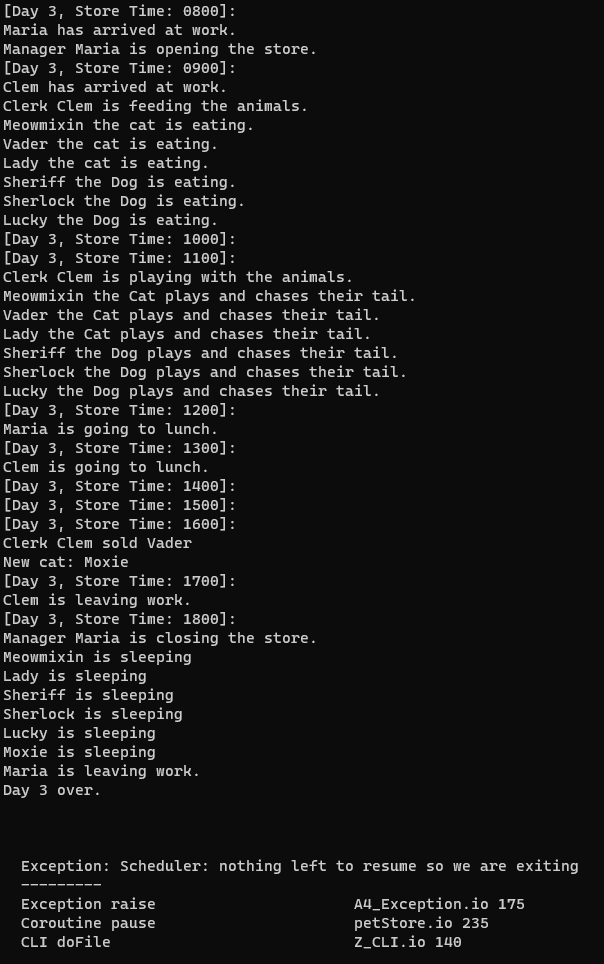

# Io Exploration - Project 3

## Name: Maria Mills

## Part 2b

## Three things I liked about this project:

1. Once, I got the hang of Io's syntax (around Project 3b, I'm guessing), I started to find myself actually liking it. It's just like programming in any other language (in terms of the logic) but the syntax is just different. It's not my favorite but it's not bad. It's just different. Would I want to use it for a project? Probably not. But it's not bad. It's just different. It has similar concepts to other languages. It just looks different and takes some getting use too, just like any other language.
2. I liked how concurrency is handled in Io, creating an actor just by acting `@@` is very simple and easy to understand. I really did find myself enjoying project 3b, It was fun creating objects, instances, methods, etc. I think I found it the most fun because by the time I got to project 3b I knew enough about the syntax to actually figure out how to do things. I think that's why I enjoyed it so much. Io isn't that bad at all.
3. I actually do like the whole concept of 'message' and 'Receivers'. Like with printing, you put the `println` message on the right and the String you want to print on the left. It's just an easy concept to grasp and I found it to be very interesting. I also liked how you could chain messages together, like with `interpolate` and then `println`. Very cool. Reminds me of Java streams.

## Three things I disliked about this project:

1. Now, I'm going to see contradictory with my likes and dislikes but let me explain. At first, I truly did NOT like the syntax, which is evident in my previous projects under "Issues". However, after using it more and more and getting the hang of it, I started to like it. So, I guess I disliked the learning curve more than the syntax/language itself. Although, the syntax in general is still weird to me and not my 'favorite'. It's just very different compared to modern day languages. So, I'm not sure what I'm listing as a dislike here. Either the syntax or the learning curve or both.
2. I wasn't fond of the parentheses versus square brackets. I just found it weird, again it was just different, not bad. This is just me nitpicking.
3. I really did not like how there is really no help for Io aside from the guide. No stackoverflow was a big slap in the face. I also did not like that there really wasn't any library support. I was able to get eerie installed and working on Ubuntu but figuring out how to find and use libraries was a whole other battle that I just did not feel like fighting. Installing Io was a struggle enough in itself for me.

#### Resources

- [Io Wiki](https://en.wikibooks.org/wiki/Io_Programming#:~:text=Use%20the%20double%20dot%20operator,string%20interpolation%2C%20as%20shown%20below.&text=Now%2C%20calling%20olle%20fullname%20will,parentheses)%20for%20the%20method%20..)
- [Io Reference](https://iolanguage.org/reference/)
- [Io Guide](https://iolanguage.org/guide/guide.html)
- [Io Samples](https://iolanguage.org/samples/index.html)
- The book "Seven Languages in Seven Weeks"
- Class slides
- [Linear Congruential Generator](https://www.educative.io/answers/pseudo-random-number-using-the-linear-congruential-generator)

#### Results:

