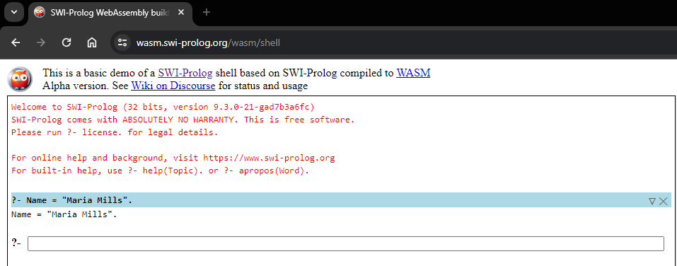
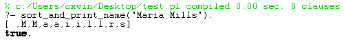
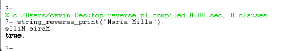
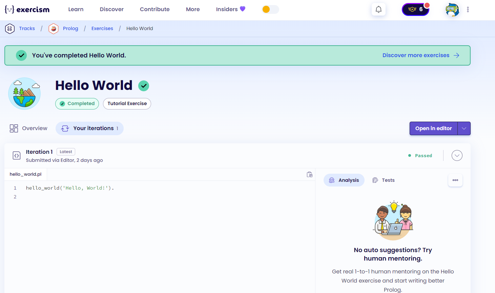
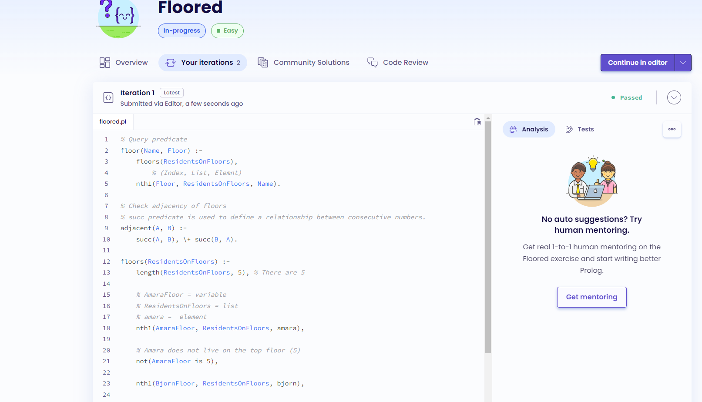
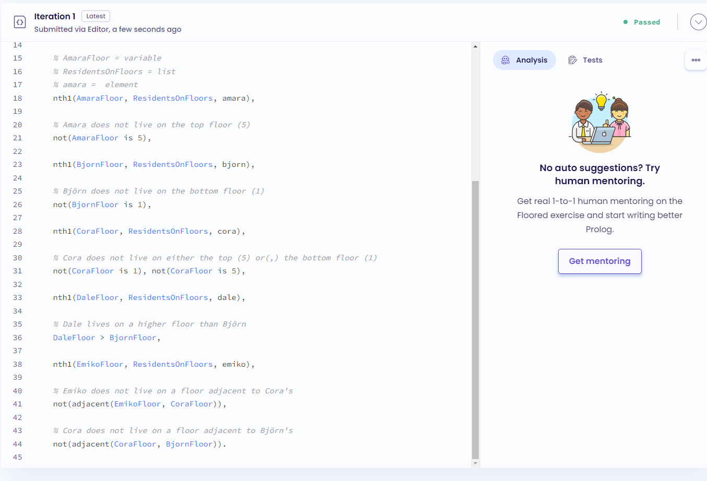
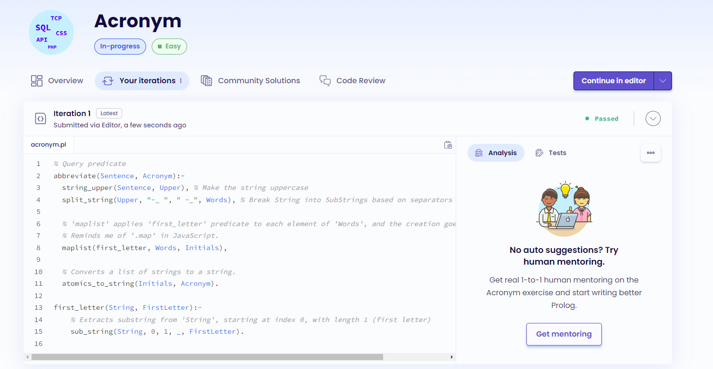
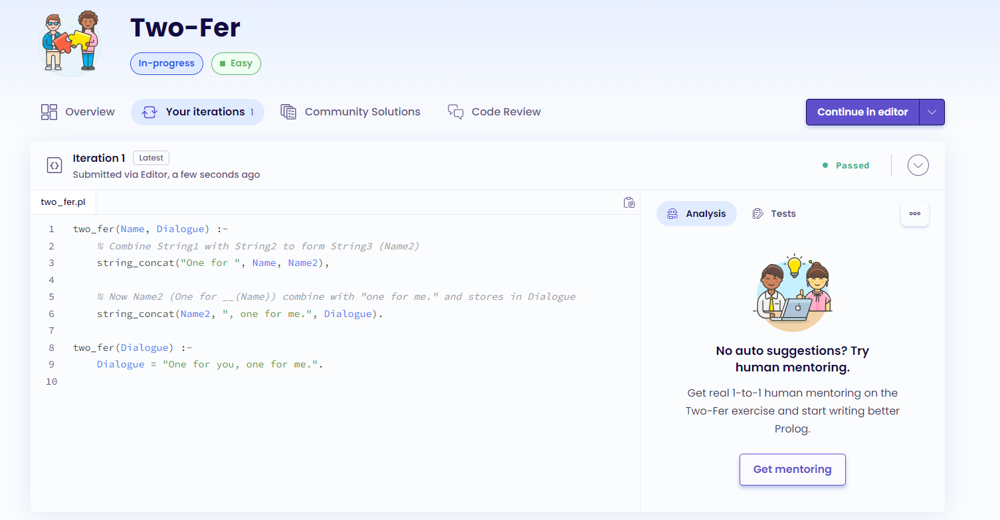
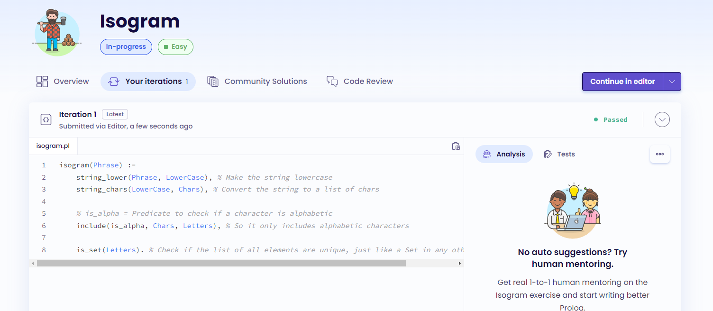

# Prolog Exploration - Project 4

## Name: Maria Mills

## Issues:

- Understanding Prolog. It's not what I'm used to at all, I think I understand a concept such as knowledge base, facts and rules and then I'm hit with another example in the book and I find myself lost again.
- I found myself constantly trying to code imperatively and writing instructions sequentially. I had to keep reminding myself that Prolog is a declarative language and that I need to think in terms of facts and rules.. which is still hard for me to grasp fully. Understanding the concept and executing it are two different things.
- With `sort/2` predicate, I kept getting the result `[ ,M,a,i,l,r,s]` and I could not figure out why. It turns out that `sort/2` removes duplicates... which is **clearly** stated in the documentation, I just kept reading too fast, lesson definitely learned. This lead to me to discover `msort/2` which does not remove duplicates.

## Part 2a

### Step 1:

1. Create a variable `Name` and assign it your first and last name.
   

2. Sort and return your name’s characters in alphabetical order. (See `sort.pl` for the code.)
   

3. Reverse and return your name. (See `reverse.pl` for the code.)
   

#### Resources

- The book
- Class slides
- [learnxinyminutes](https://learnxinyminutes.com/docs/prolog/)
- [What does % symbol mean in Prolog?](https://stackoverflow.com/questions/50668708/what-does-the-symbol-mean-in-prolog) - I was trying to figure out how to comment in Prolog and found this stackoverflow question.
- [string_chars/2](https://www.swi-prolog.org/pldoc/doc_for?object=string_chars/2) - When trying to figure out how to convert a string to a list of characters.
- [sort/2](https://www.swi-prolog.org/pldoc/man?predicate=sort/2) - When trying to figure out how to sort a list.
- [msort/2](https://www.swi-prolog.org/pldoc/doc_for?object=msort/2) - When trying to figure out how to sort a list without removing duplicates.
- [Execrcism Reverse String](https://exercism.org/tracks/prolog/exercises/reverse-string) - I looked at solutions to this problem to see how to reverse a string in Prolog.

---

### Step 2:

#### Hello, World!:

1. Floored:
   
   

2. 

3. 

4. 

#### Resources

- The book
- Class slides
- [nth/1/3](https://www.swi-prolog.org/pldoc/man?predicate=nth1/3)
- [succ/2](https://www.swi-prolog.org/pldoc/man?predicate=succ/2)
- [First elements of list Prolog](https://stackoverflow.com/questions/54011157/first-elements-of-list-of-list-prolog)
- [maplist/3](https://www.swi-prolog.org/pldoc/doc_for?object=maplist/3)
- [split_string/4](https://www.swi-prolog.org/pldoc/man?predicate=split_string/4)
- [string_upper/2](https://www.swi-prolog.org/pldoc/doc_for?object=string_upper/2)
- [atomics_to_string/2](https://www.swi-prolog.org/pldoc/man?predicate=atomics_to_string/2)
- [string_concat/3](https://www.swi-prolog.org/pldoc/man?predicate=string_concat/3)
- [string_lower/2](https://www.swi-prolog.org/pldoc/man?predicate=string_lower/2)
- [string_chars/2](https://www.swi-prolog.org/pldoc/doc_for?object=string_chars/2)
- [include/3](https://www.swi-prolog.org/pldoc/doc_for?object=include/3)
- [Is there an alphabetical character check in Prolog?](https://stackoverflow.com/questions/1483119/is-there-an-alphabetical-character-check-in-prolog)
- [is_set/1](https://www.swi-prolog.org/pldoc/doc_for?object=is_set/1)
