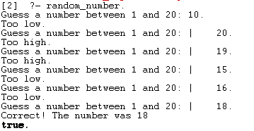
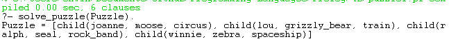
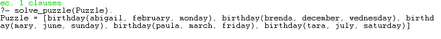

# Prolog Exploration - Project 4b

## Name: Maria Mills

## Issues:

- I had a little bit of trouble figuring out how to get the conditional to work in the guessing game. Even with the stackoverflow post, I had to play with it a bit, a little trial and error, but nothing too bad.

## Part 2b

### Program 1:

- Guessing Game:
  

#### Resources

- Class slides
- [random/1](https://www.swi-prolog.org/pldoc/man?predicate=random/1)
- [truncate/1](<https://www.swi-prolog.org/pldoc/doc_for?object=f(truncate/1)>)
- [Conditional Statements](https://stackoverflow.com/questions/26003045/conditional-statements-in-prolog)

---

### Program 2:

- Puzzle1:
  

#### Resources

- Provided puzzle with clues
- Class slides
- [Peolog unique value](https://stackoverflow.com/questions/44289749/prolog-unique-value-in-list)
- [List contains a given member](https://stackoverflow.com/questions/33910925/define-a-rule-to-determine-if-a-list-contains-a-given-member)
- [member/2](https://www.swi-prolog.org/pldoc/man?predicate=member/2)
- [permutation/2](https://www.swi-prolog.org/pldoc/man?predicate=permutation/2)
- [Prolog - Lists](https://www.tutorialspoint.com/prolog/prolog_lists.htm)

### Program 2:

- Puzzle2:
  

#### Resources

- Provided puzzle with clues
- Class slides
- [Peolog unique value](https://stackoverflow.com/questions/44289749/prolog-unique-value-in-list)
- [List contains a given member](https://stackoverflow.com/questions/33910925/define-a-rule-to-determine-if-a-list-contains-a-given-member)
- [member/2](https://www.swi-prolog.org/pldoc/man?predicate=member/2)
- [permutation/2](https://www.swi-prolog.org/pldoc/man?predicate=permutation/2)
- [compute Index of element in list](https://stackoverflow.com/questions/4380624/how-compute-index-of-element-in-a-list)
- [maplist/2](https://www.swi-prolog.org/pldoc/man?predicate=maplist/2)
