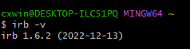
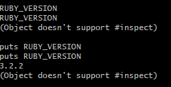
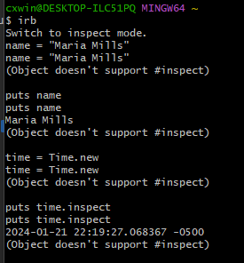
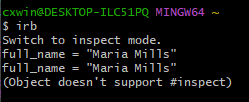
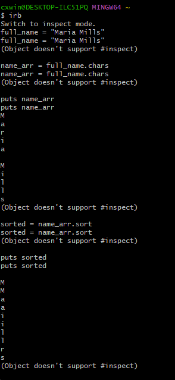
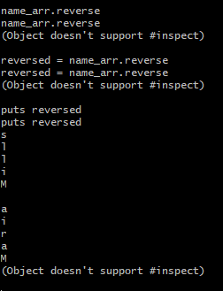
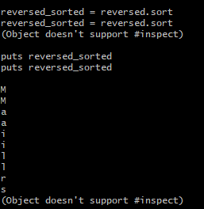
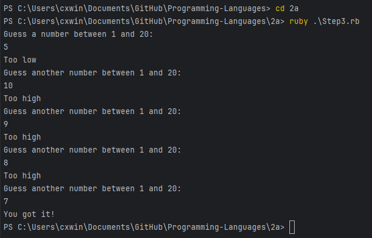

# Ruby Exploration - Project 2

## Name: Maria Mills

## Issues: None

## Part 2a

### Step 1:

#### Resources

- [How to check the version of IRB](http://www.java2s.com/Code/Ruby/Language-Basics/ChecktheversionofInteractiveRuby.htm)
- [How to check ruby version](https://blog.arkency.com/which-ruby-version-am-i-using-how-to-check/)

---

#### Resources

- The book
- [How to get date and time](https://www.tutorialspoint.com/ruby/ruby_date_time.htm)

---

### Step 2:

1. 

---

2. 
   1. First, I searched how to sort in ruby and found [this](https://www.rubyguides.com/2017/07/ruby-sort/). I noticed it was for Arrays & Hashes and I looked more and just kept seeing results to use `.sort` (which is for Arrays).
   2. So then I looked into how to convert a String into an Array of chars, which led me [here](https://stackoverflow.com/questions/4870258/ruby-convert-string-into-array-of-characters). I tried the highest rated answer `.chars` and it worked fine.
   3. Then I was able to use the `.sort` method, I saw in the resource mentioned i.

---

3. 
   1. First, I searched ruby array reverse in which I found [this stackoverflow question](https://stackoverflow.com/questions/5241185/reversing-the-order-of-an-array-in-ruby). So I tried using `.reverse` on `name_arr` and it worked fine. I also know that [this](https://www.rubyguides.com/2017/07/ruby-sort/) (from the first 'how to sort' question) also had instructions on how to sort in Reverse Order but it made use of `sort_by` but it mentioned the `reverse` method.

---

4. 
   1. Finally, I just used `.sort` on the already reversed array of chars.

### Step 3:

#### Resources

- [Getting user input](https://ruby-doc.org/docs/ruby-doc-bundle/Tutorial/part_02/user_input.html)
- [Random](https://ruby-doc.org/core-2.4.1/Random.html)
- [Ruby Loops](https://www.geeksforgeeks.org/ruby-loops-for-while-do-while-until/)
