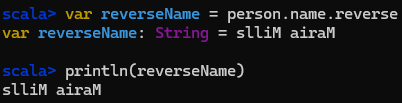

# Scala - Project 5

## Name: Maria Mills

## Part 5a

### Step 1:

- Create a class called `Person` with a string attribute of name:
  

- Create an instance of Person using your first name:
  

- Set that instance's name to your first and last name:
  

- Display your name from the object:
  

- Reverse and display your name:
  

- Sort and display your name's characters:
  

- Sort and display your name's characters in reverse alphabetical order:
  

#### Resources

- [Scala Docs](https://docs.scala-lang.org/getting-started/index.html#using-the-command-line)
- The book
- [Reverse](https://www.scala-lang.org/api/current/scala/collection/StringOps.html)
- [Sorting strings](https://stackoverflow.com/questions/52288365/sorting-strings-using-orderedstring-in-scala) - Not the chosen solution
- [sorted](https://www.scala-lang.org/api/current/scala/collection/StringOps.html#sorted-fffffc06) - Didn't discover it until that stackoverflow answer

##### Issues:

- 'value name cannot be accessed as a member of (person : Person)' - [Just had to add the `val` keyword to make it public.](https://stackoverflow.com/questions/26331386/why-cant-i-access-my-objects-member-variable) - later realizing I need to use `var` to change the name later.
- Mixing up `val` and `var`.
- Had a little trouble figuring out how to sort, there seems many different ways to sort and a lot of them were a bit confusing to me, glad I found `sorted`.

---

### Step 2:

1. 

#### Resources

- [ArrayBuffer](https://docs.scala-lang.org/scala3/book/collections-classes.html#arraybuffer)
- [ArrayBuffer GeeksforGeeks](https://www.geeksforgeeks.org/scala-arraybuffer/)
- [Classes](https://docs.scala-lang.org/tour/classes.html#inner-main)
- [Control Structures](https://docs.scala-lang.org/scala3/book/control-structures.html)
- [How to take user input](https://stackoverflow.com/questions/5055349/how-to-take-input-from-a-user-in-scala)
- [Ask for User Input](https://docs.scala-lang.org/scala3/book/taste-hello-world.html#ask-for-user-input)
- [Shuffle Collections in Scala](https://www.baeldung.com/scala/shuffle-list-map-set)
- [foreach](https://stackoverflow.com/questions/45165065/foreach-loop-in-scala)
- [subString](https://www.geeksforgeeks.org/scala-string-substring-method-with-example/)
- [Collection methods](https://docs.scala-lang.org/scala3/book/collections-methods.html)
- [grouped](https://www.baeldung.com/scala/sliding-grouped-methods-with-collections)
- [mkString](https://www.geeksforgeeks.org/scala-list-mkstring-method-with-a-separator-with-example/)
- [Main method in Scala](https://stackoverflow.com/questions/23416536/main-method-in-scala)
- [Main methods in Scala](https://docs.scala-lang.org/scala3/book/methods-main-methods.html)

##### Issues:

- Trying to use this language 100% like Java, which is not the case, especially for for loops and creating functions, etc.
- Getting the 'main' method to work, I was trying to use the `main` method like Java, but I had to use `def main(args: Array[String]): Unit = {` instead of `public static void main(String[] args) {`. Tried to use the new Scala 3 syntax for the main method, but it wouldn't work for me for some reason?? So I just ended up using the backwards compatible Scala 2 syntax. At least it worked.
