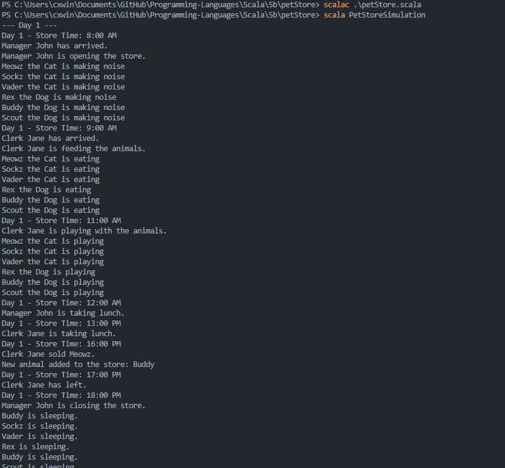
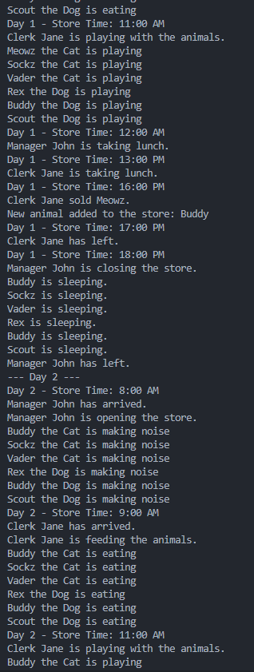
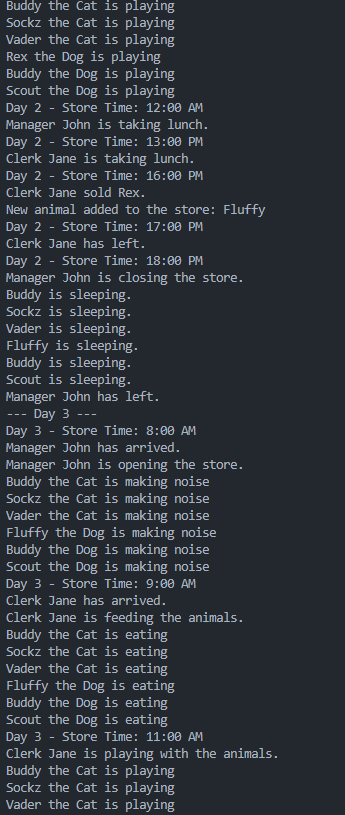
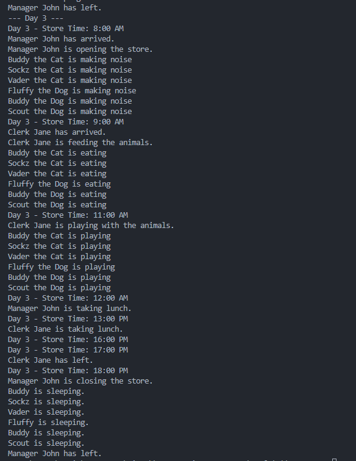

# Scala - Project 5

## Name: Maria Mills

## Part 5b

### Step 1:

- Please see `petStore.scala` in /petsStore

#### Results:

#### Resources

- The book
- Class slides
- [Scala Lists](https://www.geeksforgeeks.org/scala-lists/)
- [ArrayBuffer](https://docs.scala-lang.org/scala3/book/collections-classes.html#arraybuffer)
- [Classes](https://docs.scala-lang.org/tour/classes.html)
- [Traits](https://docs.scala-lang.org/tour/traits.html)
- [Abstract classes](https://docs.scala-lang.org/scala3/book/domain-modeling-tools.html#abstract-classes)
- [Abstract vs Trait](https://www.baeldung.com/scala/traits-vs-abstract-classes)
- [Remove from list](https://stackoverflow.com/questions/12864505/how-can-i-idiomatically-remove-a-single-element-from-a-list-in-scala-and-close)
- [Replace element in list](https://stackoverflow.com/questions/5062435/replace-element-in-list-with-scala)
- [For loops](https://docs.scala-lang.org/overviews/scala-book/for-loops.html)
- [Control Structures](https://docs.scala-lang.org/scala3/book/control-structures.html#for-loops)
- [Pattern matching](https://docs.scala-lang.org/tour/pattern-matching.html)

##### Issues:

- Understanding traits vs. abstract classes.
- Tried to use it like Io, forgetting I had to set the methods in the parent classes and have the child classes override them. I was stuck on this for a little and kept getting errors until it finally hit me, that Scala is more like Java.

---
